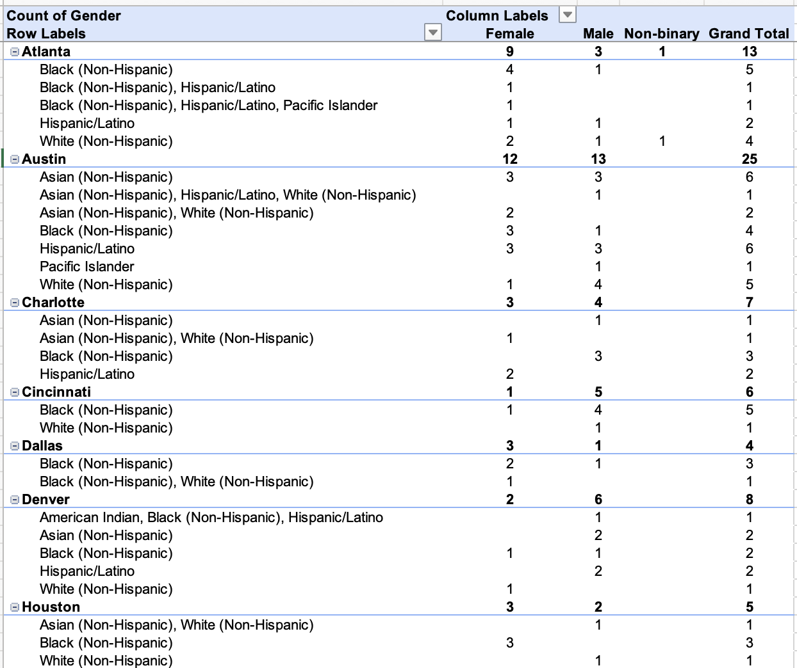
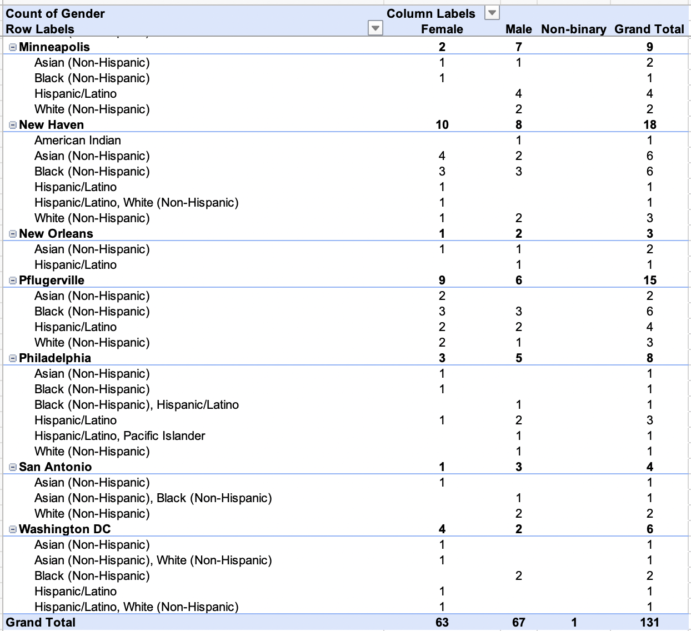
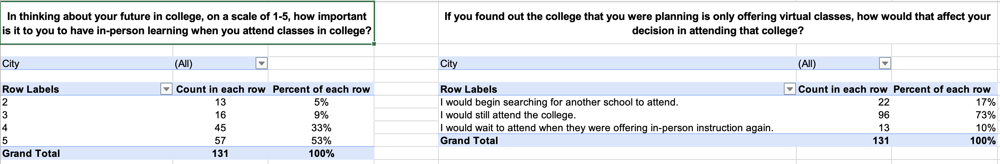
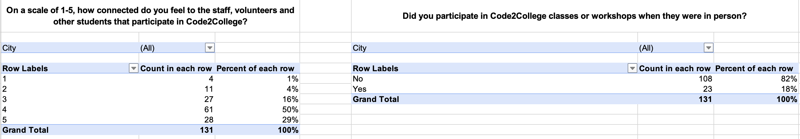
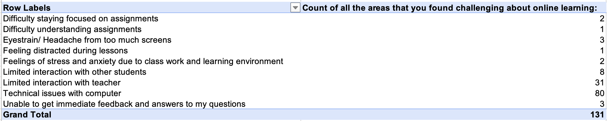
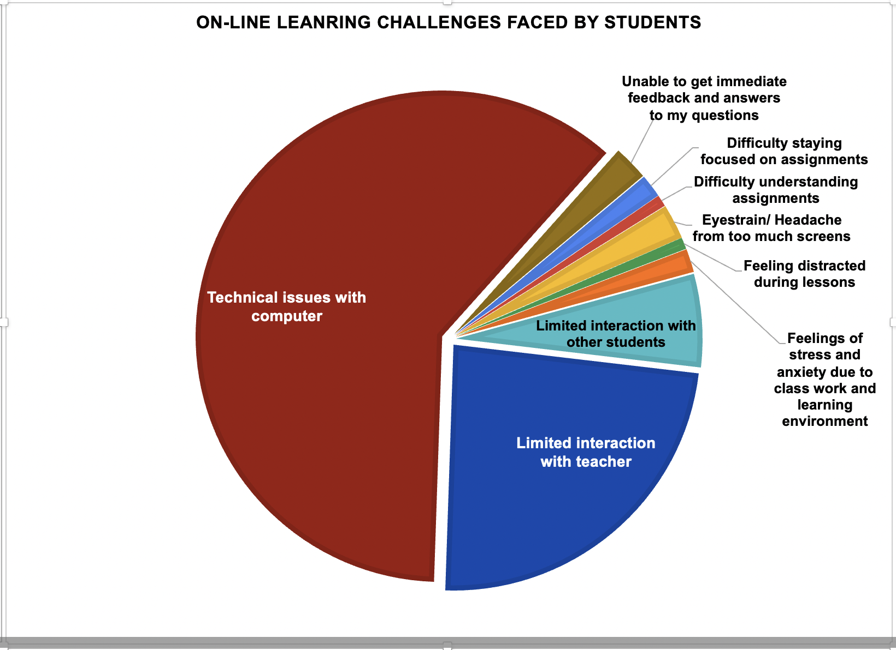
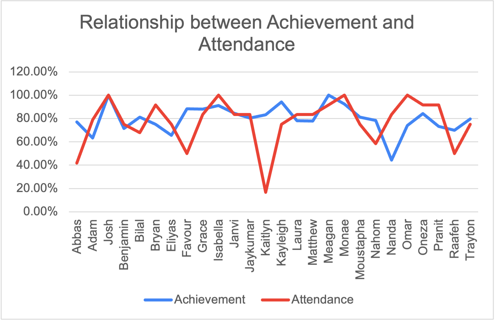
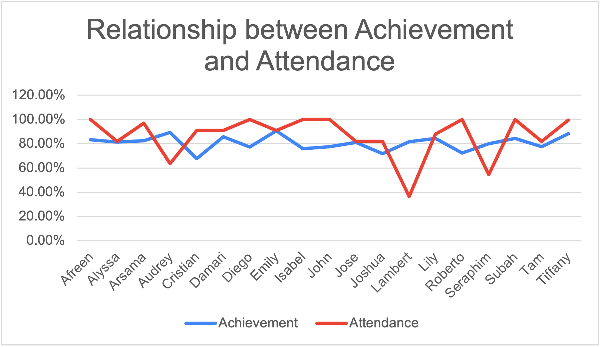
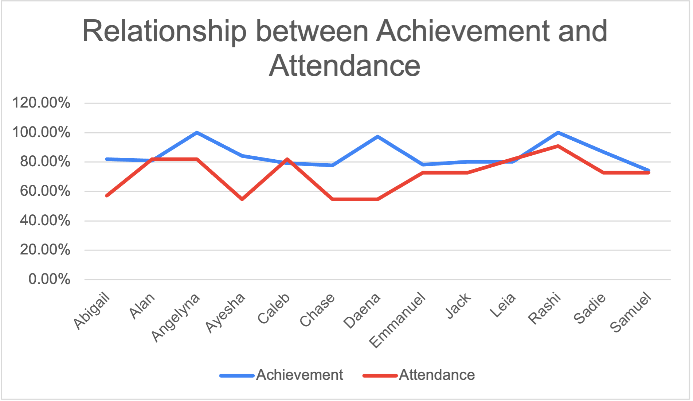

# C2C Performance Activity

## Virtual Engagement Data Analysis and Interpretation

## Achievement Data Analysis and Interpretation

## Growth Data Analysis and Visualization

[Link to Storyboard](https://public.tableau.com/app/profile/alphonso.porras/viz/BikesRFunStory/BikesRFun)
