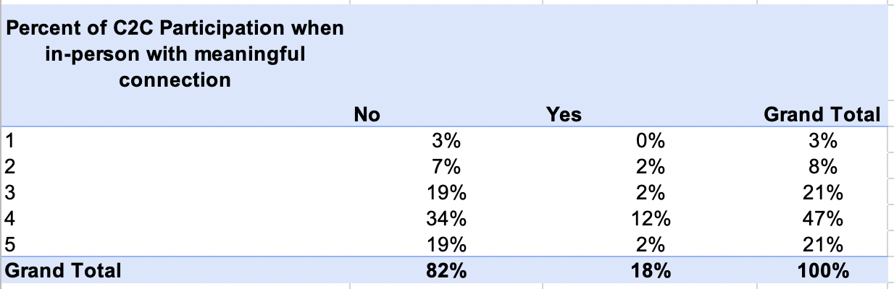

# C2C Performance Activity

## Virtual Engagement Data Analysis and Interpretation

Below please find a table of the demographics of students that attend Code2College

To summarize, the enrollment shows an about even split between self-identified males and females. Additionally, a majority of the enrolled students are of an  underrepresnted population. 

The table below shows a disconnect between 73% of students that would still attend college even if it was only offering virtual classes and 86% of students that either agreed or strongly aggreed that in-person learning in college is important. However, this could be interpreted as students having experiences that engaged them in virtual classes. This notion is explained further in the following section.

Looking at the two charts below, 18% of students had participated in C2C in person. Of that 18%, only 14% of students agreed or strongly agreed that they feel a strong connection to staff, volunteers, and other students. However, 53% of students that had not participated in C2C in person indicated that they either agreed or strongly agreed that thay feel a sstrong connection to staff, volunteers, and other students. 

Depending on C2C's goal and rigor of their matrices, I would say that C2C does well with making and keeping connections either virtually or in-person. However, this is a slim margin. 

To address the threats that C2C needs to be mindful of, I created the following charts:

As you can see, technical issues is more than 60% of the challenges faced by students. Additionally, 23% of students indicated that limited interactions with teachers was a challenge. 

## Achievement Data Analysis and Interpretation

The three charts below show the relationship between attendance and achievement. And though we want to tell ourselves that attendance matters, this particuplar data is telling a different story. In fact, it show the opposite: School C has poorer attendance but high achievement; and School A has individuals that perform better than their peers that have a better attendance record.

Indeed, there is alot happening here. Perhaps too much is assumed and more infomation would be required to see a brighter picture. 

Some addtional questions to ask would be:
- Accuracy of attendance in each class?
- Demographics in relation to accessibility of resources (ie. internet access, quiet space, correlation to achievement, attendance, or both)?
- Was there a prerequisite to get into the class?
- Scores in previous classes?

## Growth Data Analysis and Visualization

Please follow the link below to see the explaination and visualiztion for this secion.
[Link to Storyboard](https://public.tableau.com/views/Code2College/C2CViz?:language=en-US&publish=yes&:display_count=n&:origin=viz_share_link)
